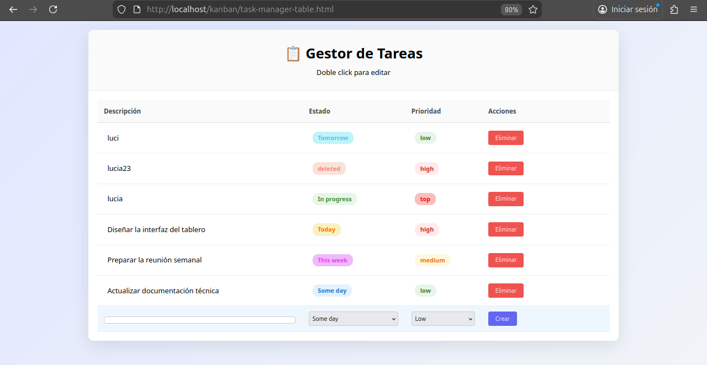

# Proyecto Interdisciplinar – Sistema de Gestión Kanban Board
**Asignatura:** Proyecto Interdisciplinar  
**Autora:** Lucía Ferrandis

## 1. Introducción
Los tableros Kanban permiten visualizar el flujo de trabajo, identificar cuellos de botella y mejorar la productividad en equipos ágiles.

Este proyecto interdisciplinar reúne competencias de diseño de interfaces (DIW), desarrollo web full-stack, gestión de bases de datos, y arquitectura de aplicaciones, implementando un sistema completo de gestión de tareas tipo Kanban.

El objetivo final es construir una aplicación funcional que aplique principios de usabilidad, persistencia de datos, interactividad avanzada, y modelo MVC.

## 2. Objetivo General
Desarrollar una aplicación web completa capaz de:

- Crear, editar y eliminar tareas dinámicamente (CRUD).

- Organizar tareas en columnas Kanban (To Do, In Progress, Done).

- Mover tareas mediante drag & drop.

- Guardar los datos en una base de datos MySQL.

- Ofrecer una interfaz moderna, responsive y usable.

- Permitir filtros, búsqueda y gestión visual del flujo de trabajo.

## 3. Requisitos del Proyecto
### 3.1 Funcionalidad Básica
- Sistema CRUD de tareas.

- Al menos 3 columnas Kanban: Por Hacer, En Progreso, Terminado.

- Drag & drop con JavaScript.

Cada tarea contiene:

- Descripción

- Estado (columna actual)

- Prioridad (Top, Alta, Media, Baja)

- Acciones (Eliminar)

### 3.2 Tecnologías Utilizadas
- Frontend: HTML5, CSS3, JavaScript ES6+

- Backend: PHP 7.4+

- Base de datos: MySQL

- Comunicación: Fetch API (AJAX)

### 3.3 Diseño e Interfaz
- Diseño responsive

- Código de colores para prioridades

- Sistemas de feedback visual (errores, carga, acciones)

- Accesibilidad básica

## 4. Arquitectura del Proyecto (MVC)
Estructura recomendada:

    /ProyecKanban
    
      /kanban

        /css
          styles.css
          responsive.css

        /js
          tasks.js
          test_api_client.js

        /json
          package.json

        /php
          db.php
          tasks.php

        /sh
          /test_api.sh

        /sql
          kanban_setup.sql
          
        ReadMe.md
        task-manager-table.html
        imagen.png

Descripción de Archivos

- styles.css → Proporciona los estilos

- tasks.js → lógica de la tareas

- test_api_client.js → comprueba que funcionan los clientes

- package.json → intercambia datos entre los sistemas

- db.php → conexión MySQL

- tasks.php → API REST CRUD

- test_api.sh → comprueba que funciona la api

- kanban_setup.sql → creación de tablas

- task-manager-table.html → estructura principal del tablero

## 5. Base de Datos
Tablas necesarias:

**Tabla tasks (resumida)**

```sql
CREATE TABLE tasks (
  id INT AUTO_INCREMENT PRIMARY KEY,
  title VARCHAR(255) NOT NULL,
  description TEXT,
  status ENUM('todo','in_progress','done') DEFAULT 'todo',
  priority ENUM('high','medium','low') DEFAULT 'medium',
  created_at TIMESTAMP DEFAULT CURRENT_TIMESTAMP,
  updated_at TIMESTAMP DEFAULT CURRENT_TIMESTAMP ON UPDATE CURRENT_TIMESTAMP
);
```
## 6. API REST
Endpoints Disponibles
- GET /api/tasks.php → listar tareas

- POST /api/tasks.php → crear tarea

- PUT /api/tasks.php?id={id} → actualizar

- DELETE /api/tasks.php?id={id} → eliminar

- PATCH /api/tasks.php?id={id} → cambiar solo el estado

## 7. Diagrama de Flujo (simplificado)

    Usuario → Frontend → GET /api/tasks → PHP/API → MySQL
                ↑                                      ↓
                PATCH / PUT / POST / DELETE ← Confirmación

## 8. Funcionalidades Opcionales
- Usuarios y roles

- Asignación de tareas

- Fechas límite con alertas

- Historial de cambios

- Exportación CSV/PDF

- Modo oscuro

- Notificaciones en tiempo real

## 9. Guía de Instalación
- Copiar carpeta en htdocs:

      /opt/lampp/htdocs/kanban

- Iniciar Apache/MySQL:

       sudo /opt/lampp/lampp start

- Importar database.sql en phpMyAdmin.

- Configurar credenciales en /php/config/database.php.

- Abrir en navegador:

  - http://localhost/kanban/task-manager-table.html

## 10. Manual de Usuario
- Crear tareas desde el formulario

- Editar con doble clic

- Arrastrar tarjetas entre columnas

- Filtrar por prioridad/estado

- Buscar por texto

## 11. Pruebas Realizadas
- Pruebas CRUD completadas
 
- Validación de formulario

- Comprobación de arrastre entre columnas

- Test de conexión a MySQL

- Verificación responsiva (móvil/tablet/PC)

- Visualización de la página:



## 12. Conclusiones y Mejoras Futuras
Este proyecto ha permitido aplicar conceptos clave del desarrollo web full-stack y diseño de interfaces. El resultado es un sistema funcional, mantenible y escalable.

- Posibles mejoras:
  - Autenticación completa

  -  Notificaciones en tiempo real (WebSockets)

  - Integración con APIs externas

  - Sistema de roles y permisos