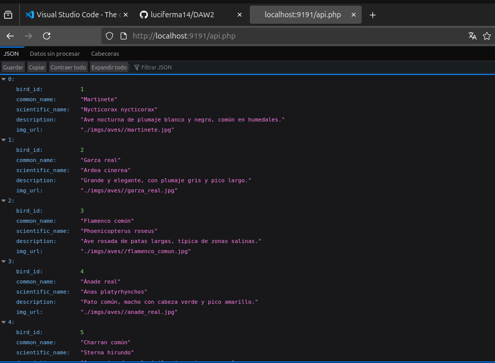
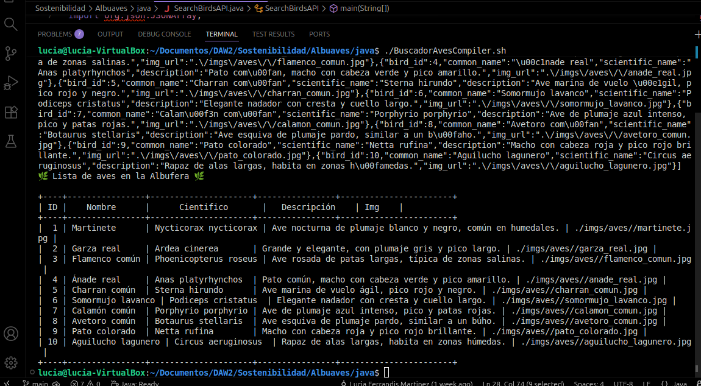

# Albuaves

**Asignatura:** Sostenibilidad

**Autora:** Lucía Ferrandis

Albuaves es un pequeño proyecto mascota ( *pet-project* ) , que pretende
de una manera sencilla plantear al alumnado todas las partes implicadas
en una Solución Software basada en la arquitectura *Cliente-Servidor*.

Por una parte tendremos una base de datos en `SQLite` que editaremos de manera
sencilla con `sqlitebrowser` y que usaremos como persistencia en el lado 
del servidor.

### Llamada a la API en el navegador


### Cliente Java ejecutándose en la terminal


## API REST
Serviremos una API Rest, programada en PHP, por ahora se plantea con dos únicas
funciones: 

El servidor expone dos endpoints:

### Listar todas las aves  
`GET /api.php`

### Obtener un ave por ID  
`GET /api.php?bird_id=3`


## Software Requerido

* sqlitebrowser
* php-sqlite3

### Comandos para la instalación en máquinas de desarrollo

```bash
sudo apt update; 
sudo apt install sqlitebrowser php-sqlite3
```

## Tecnologías utilizadas

- PHP 8: Utilizado para el desarrollo del servidor y la API REST.
- SQLite: Base de datos ligera utilizada en el lado del servidor.
- sqlitebrowser: Herramienta gráfica para visualizar y editar la base de datos SQLite.
- Java 17+: Lenguaje utilizado para crear el cliente en consola que consume la API.
- JSON-Java (json-20250517.jar): Librería empleada para parsear y manejar objetos JSON en Java.
- Bash: Usado para crear scripts que automatizan la compilación y ejecución.
- Servidor PHP embebido: Permite arrancar rápidamente la API REST sin necesidad de instalar Apache o Nginx.

## Licencias

- JSON-Java → Licencia BSD (https://github.com/stleary/JSON-java/blob/master/LICENSE)
- SQLite → Dominio Público
- PHP → PHP License

## Motivaciones de diseño

- SQLite: No requiere servidor, ideal para prácticas y entornos educativos.
- PHP: Fácil de desplegar con un solo comando (`php -S localhost:9191`).
- Java: Permite crear un cliente robusto y portable.
- *SON-Java: Librería estándar y muy sencilla para manejar JSON.
- Bash Scripts: Automatizan tareas para no depender del entorno del usuario.

## Estructura del proyecto

    Albuaves/

        db/
            albuaves-db-create.sql
            albuaves-tables-population.sql
            albuaves.db
            albuaves2.db
        imgs/
            **Todas la fotos**
        java/
            SearchBirdsAPI.java
            json-20250517.jar
            BuscadorAvesCompiler.sh
            albuaves_api_rest.java
        php/
            api.php

        Readme.md
        run-api-server.sh

## Tutorial HOW-TO

### 1. Arrancar el servidor PHP

Script proporcionado:

```bash
./Server.sh
```
Este script ejecuta:

```bash
php -S localhost:8000 -t api/
```
La API queda disponible en:

    http://localhost:8000/api.php

### 2. Compilar y ejecutar el cliente Java

```bash
./cliente_java/BuscadorAvesCompiler.sh
```
El script:

Compila el archivo Java:
```bash
javac -cp .:json-20250517.jar SearchBirdsAPI.java
```
Ejecuta el cliente:

```bash
java -cp .:json-20250517.jar SearchBirdsAPI
```

### Enlaces útiles

**JSON-Java**
https://github.com/stleary/JSON-java

**SQLite** 
https://www.sqlite.org/index.html

**PHP**
https://www.php.net/